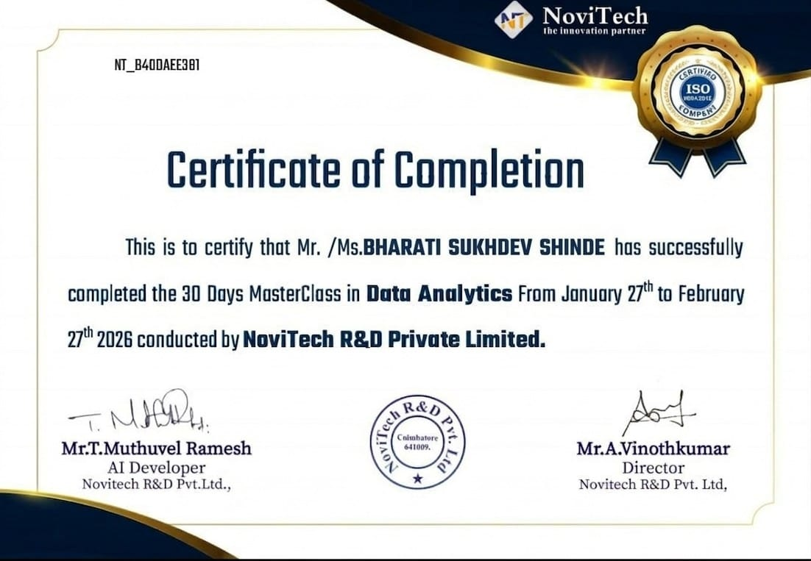
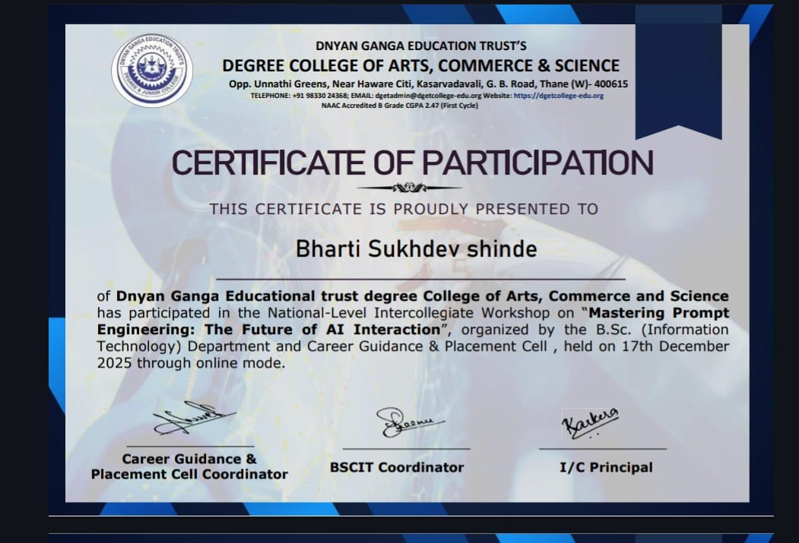

# 📊 Data Analytics Learning Portfolio

This repository showcases my journey in Data Analytics, including certifications and hands-on learning in data visualization, analysis, and problem-solving.

---

## 📜 Certifications

### 📊 Data Analytics Masterclass
- Completed a 30-day intensive program focused on real-world data analysis  
- Gained practical experience in:
  - Data Cleaning & Preprocessing  
  - Data Visualization Techniques  
  - Basic Analytical Thinking  

**Tools Used:** Excel, Power BI, Tableau  

---

### 🤖 Prompt Engineering
- Learned how to effectively structure prompts for AI tools  
- Improved problem-solving and automation using AI  

---

## 🚀 Next Steps
I am currently working on:
- Building real-world Data Analytics projects  
- Strengthening SQL and Python skills  
- Creating interactive dashboards  

---

## 🎯 Goal
To become a skilled Data Analyst capable of turning data into actionable insights.

## 🔗 Connect with Me
- LinkedIn: https://www.linkedin.com/in/bharti-shinde
- GitHub: https://github.com/Bharti856
